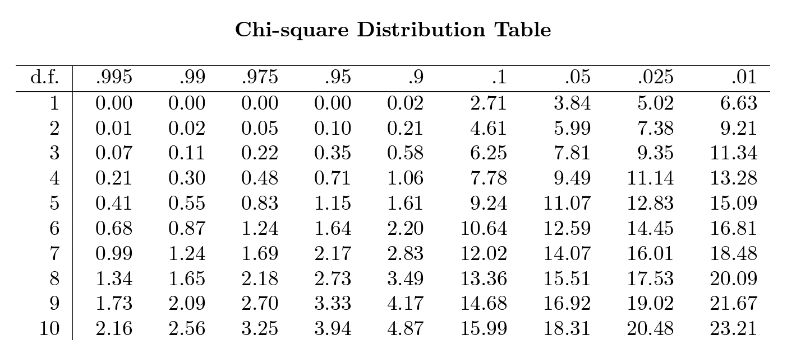

# ComputerVision02504

This repository contains my personal notes and notebooks used as part of the course 02504 Computer Vision, at DTU in Spring 2024. Syntax for writing markdown can be found at [ashki23](https://ashki23.github.io/markdown-latex.html).

## Topics Covered

|Week               | Topic     |
|:------------------|:----------|
| [Week 1: Pinhole and homogeneous](#week-1-pinhole-and-homogeneous) | Homogenous coordinates <br> pinhole model <br> projection |
| [Week 2: Camera model and homography](#week-2-camera-model-and-homography) | Camera model <br> Lens distortion <br> Homography <br> Point normalization |
| [Week 3: Multiview geometry](#week-3-multiview-geometry) | Epipolar <br> Triangulation |
| [Week 4: Camera calibration](#week-4-camera-calibration) | Linear camera calibration|
| [Week 5: Nonlinear and calibration](#week-5-nonlinear-and-calibration) | Levenberg-Marquardt <br> Gradients <br> Rotations in optimization |
| [Week 6: Simple Features](#week-6-simple-features) | Harris corner <br> Gaussian filtering <br> Gaussian derivative |
| [Week 7: Robust model fitting](#week-7-robust-model-fitting) | Hough line <br> Hough transform <br> RANSAC |
| [Week 8: SIFT features](#week-8-blobs-and-sift-features) | BLOB detection <br> Scale space pyramid <br> Difference of Gaussians <br> SIFT features |
| [Week 9: Geometry Constrained Feature<br> Matching](#week-9-geometry-constrained-feature-matching) | Esimate Fundamental matrix using RANSAC <br> Sampson's distance |

## Installation

Clone the repository.

```bash
git clone https://github.com/yufanana/ComputerVision02504.git
cd ComputerVision02504
```

Create an environment with `Conda`.

```bash
conda create --name cv
pip install -r requirements.txt
```

Or, create a Python virtual environment with `virtualenv`.

```bash
pip install virtualenv
virtualenv .venv
source .venv/bin/activate
pip install -r requirements.txt
```

```bash
# On Windows
.venv/Scripts activate
pip install -r requirements.txt
```

When running the Jupyter notebooks, select kernel of the environment previously created.

## Development

Set up pre-commit for code checking. Hooks can be found in `.pre-commit-config.yaml`

```bash
conda activate cv
pre-commit install
pre-commit run --all-files
pre-commit run --file my_file.ipynb
```

Now, `pre-commit` will run every time before a commit. Remember to do `git add .` to add the changes made by the pre-commit (if any). Hooks can be temporarily disabled using:

```bash
git commit -m "<message>" --no-verify
```

## Week 1: Pinhole and Homogeneous

[Back to top](#topics-covered)

## Week 2: Camera Model and Homography

[Back to top](#topics-covered)

## Week 3: Multiview Geometry

[Back to top](#topics-covered)

## Week 4: Camera Calibration

[Back to top](#topics-covered)

## Week 5: Nonlinear and Calibration

[Back to top](#topics-covered)


  - Levenberg-Marquardt: least squares problem with 2nd order approximation using only 1st order derivatives
  - Gradients: analytical or finite differences (Taylor series)
  - Rotations in Optimization (euler angles, axis angles, quaternions)

## Week 6: Simple Features

[Back to top](#topics-covered)

Problems with image correspondence

- Scale, rotation, translation $\rarr$ appearance changes depending on distance and pose of camera
- Other issues: occlusion, lighting intensity, lighting diretion, clutter
- Key points/interest points/feature points: coordinate position of points in an image
- Descriptors: characterizes pattern around a point (usually a vector)

Convolution

- Synonymous with filtering.
- Is commutative $I_g = g * I = I * g$
- Is separable $I_g = (g*g^T) * I = g * (g^T*I)$
- Size of Gaussian filter
  - Uses an empiric rule of $3\sigma$ or $5\sigma$
  - size = $ 2 \cdot rule \cdot \sigma + 1$
  - e.g. 5-rule, $\sigma=2$, size $= 2 \cdot 5 \cdot 2 + 1 = 21$


Derivative of Gaussian

$$
g_d(x) = \frac{d}{dx}g(x) = \frac{-x}{\sigma^2}g(x)
$$

Derivative of blurred image $I_b$ in the x-direction is

$$
\begin{align*}
\frac{\partial}{\partial x}I_b &= \frac{\partial}{\partial x}(g * g^T * I) \\
&= g * (\frac{\partial}{\partial x}g^T) * I \\
&= g * g_d^T * I
\end{align*}
$$

Harris Corners

- Points with locally maximum change from a small shift
- A local area where $\Delta I(x,y,\Delta_x, \Delta_y)^2$ is large no matter $\Delta_x, \Delta_y$

$$
\Delta I(x,y,\Delta_x, \Delta_y) = I(x,y,) - I(x+\Delta_x, y+ \Delta_y)
$$

Harris corner measure

- approximated using Taylor series expansion

$$
\begin{align*}

c(x,y,\Delta_xm \Delta_y) &= g * \Delta I(x,y,\Delta _x, \Delta _y) \\
&= g * (I(x,y,) - I(x+\Delta_x, y+ \Delta_y))^2 \\
&\approx g * (\begin{bmatrix}I_x & I_y\end{bmatrix} \begin{bmatrix} \Delta_x \\ \Delta_y \end{bmatrix})^2 \\
&= g * (\begin{bmatrix}I_x & I_y\end{bmatrix}
\begin{bmatrix}I_x^2 & I_x I_y \\ I_x I_y & I_y^2\end{bmatrix}
\begin{bmatrix} \Delta_x \\ \Delta_y \end{bmatrix}) \\
&=
\begin{bmatrix}I_x & I_y\end{bmatrix}
\begin{bmatrix}
g * (I_x^2) & g * (I_x I_y) \\[0.3em]
g * (I_x I_y) & g * (I_y^2) \\[0.3em]
\end{bmatrix}
\begin{bmatrix} \Delta_x \\ \Delta_y \end{bmatrix}

\end{align*}
$$

Structure tensor

$$
\begin{align*}

C(x,y) &=
\begin{bmatrix}
g * (I_x^2) & g * (I_x I_y) \\[0.3em]
g * (I_x I_y) & g * (I_y^2) \\[0.3em]
\end{bmatrix} \\
&= \begin{bmatrix}
a & c \\[0.3em]
c & b \\[0.3em]
\end{bmatrix} \\

\end{align*}
$$

Use eigenvalues $\lambda_1 , \lambda_2$ to find large values of $c(x,y,\Delta_x,\Delta_y)$

Harris corner metric

$$
\begin{align*}

r(x,y) &= \lambda_1 \lambda_2 - k(\lambda_1 + \lambda_2)^2  \\
&= ab - c^2 - k(a+b)^2

\end{align*}
$$

typically $k=0.06$

- Corners are at points with $r(x,y) > \tau$
- threshold $\tau$ is about $0.1\cdot max(r(x,y)) < \tau < 0.8 \cdot max (r(x,y))$
- Find local maximum using non-max suppression

Canny Edges

- Metric is the gradient magnitude

$$
m(x,y) = \sqrt{I_x^2(x,y) + I_y^2(x,y)}
$$

- Choose $\tau_1 > \tau_2$
- seed: labels edges with a $m(x,y) > \tau_1$
- grow: grow edges with a $m(x,y) > \tau_2$, label iff new points are next to previously labelled edges

## Week 7: Robust Model Fitting

[Back to top](#topics-covered)

Hough Lines

- Vertical lines are undefined in cartesian $\Rightarrow$ use polar coordinates
- Represent a line with $\theta, r$
  - $\theta$ is the angle between norm and x-axis
  - $r$ is the norm distance of the line from the origin


<!--  -->

Hough Transform

- Each point votes for all the possible lines that go through it
- Each point corresponds to a line in Hough space
- Peak in hough space $\Rightarrow$ line in image
- Find peaks using non-max suppression in a region
- Hough space not practical for more than 3 DoF


Random sample consensus, RANSAC

- Randomly sample minimum number of points needed to fit the model
  - e.g. 2 data points for a line
  - e.g. 8 corresponding data points for fundamental matrix
- Fit the model to the random samples
- Measure inliers that are close to the model below a threshold $\rarr$ indicates good fit of model
  - e.g. euclidean distance for a line
  - e.g. sampson distance for fundamental matrix
- Consensus is the number of inliers
- Keep track of best model and best inliers with the highest consensus
- Refit model to all inliers of the best model


RANSAC iterations

- Estimate the upper bound of the number of iterations required to have at least one sample with only inliers
- The estimate is updated while running RANSAC
- $\hat \epsilon = 1 - \frac{s}{m}$
  - s: no. of inliers of best model
  - m: total no. of data points
- $\hat N = \frac{log(1-p)}{log((1-(1-\hat \epsilon)^n))}$
  - p: probability that at least one of N samples has only inliers, e.g. $0.99$
- Terminate once there are more than $\hat N$ iterations

## Week 8: BLOBs and SIFT features

[Back to top](#topics-covered)

See examples in [ex8.ipynb](notebooks/ex8.ipynb)

SIFT: features localized at interest points, adapted to scale, inavariance to appearance changes

- scale-space blob detection using difference of Gaussians (DoG)
- interest point localization
- orientation assignment
- interest point descriptor

BLOB: binary large object

Hessian matrix

$$
H =
\begin{bmatrix}
I_{xx}(x,y) & I_{xy}(x,y) \\[0.3em]
I_{xy}(x,y) & I_{yy}(x,y) \\[0.3em]
\end{bmatrix}
$$

- contains 2nd order derivatives of images
- measures curvature
- eigenvalues and eigenvectors are used to measure the direction of most change
- the Laplacian is used to estimate the eigenvalues (?)
- the Laplacian is approximated with DoG

Difference of Gaussians (DoG)

- iteratively blurring already blurred images (efficient)
- scale invariance: allows features to be detected at different scales
- kernel size increase with each iteration
- $DoG = L(x,y,k\sigma) - L(x,y,\sigma)$
- the same threshold can be applied for all scale spaces
- find local extrama of DoGs in scale space

Orientation assignment

- compute orientation of gradient around BLOB
- compute circular histogram of gradient orientations
- use histogram peak to assign orientation of point

Matching descriptors

- Use Euclidean distance between normalized vectors
- Cross checking: keep matches that are closest to each other
- Ratio test: compute ratio betwen closest and 2nd closest match, keep if it is below threshold e.g. 0.7

Variations

- RootSIFT: Hellinger kernel
- SURF, ORB, BRIEF, BRISK

## Week 9: Geometry Constrained Feature Matching

[Back to top](#topics-covered)

Fundamentral and Essential Matrix

$$
\begin{align*}
E &= [t]_xR \\
F &= K_2^{-T}EK_1^{-1} \\
0 &= q_2^TFq_1
\end{align*}
$$

Estimate F by solving $0 = B^{(i)} flatten(F) $ using SVD, where:

$$
\begin{align*}
B^{(i)} &= [x_{1i} x_{2i} \ \ \
y_{1i}x_{2i} \ \ \
x_{2i} \ \ \
x_{1i}y_{2i} \ \ \
y_{1i}y_{2i} \ \ \
y_{2i}  \ \ \
x_{1i} \ \ \
y_{1i} \ \ \
1] \\

flatten(F) &= [F_{11} \ \ F_{12} \ \ F_{13}
            \ \ F_{21} \ \ F_{22} \ \ F_{23}
            \ \ F_{31} \ \ F_{32} \ \ F_{33}]^T

\end{align*}
$$

F has 9 DoF, scale invariant <br>
$\Rightarrow$ 8 data points is sufficient <br>
$\Rightarrow$ 8 pairs of corresponding points

It is also possible to estimate using 7 points.

$ q_2i^TFq_1i $ is the distance from the epipolar lines.

Use **Sampson's distance** to measure distance from model.

$$
d_{Samp} (F, q_{1i}, q_{2i}) =
\dfrac{(q_{2i}^T F q_{1i})^2}
{(q_{2i}^T F)_1^2 +
(q_{2i}^T F)_2^2 +
(F q_{1i})_1^2 +
(F q_{1i})_2^2}
$$

Threshold for RANSAC

- Assume each sample has error with m-dimensional normal distribution
- Choose a confidence level e.g. 95%
- Look up CDF for $\chi_m^2$ distribution

RANSAC Workflow

1. Find features in both images using SIFT
2. Match features using brute force matcher (e.g. 1000 matches)
3. Sample 8 of these matching features (8 points from image 1, 8 points from image 2)
4. Estimate fundamental matrix using SVD
5. Compute sampson distance to estimated F for all matches
6. Classify matches as inliers if distance < threshold
7. Repeat for fixed number of iterations
8. Refit fundamental matrix on set of best inliers


