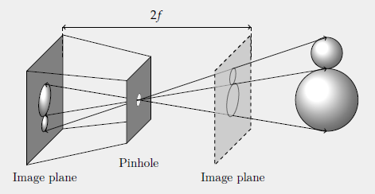
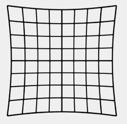
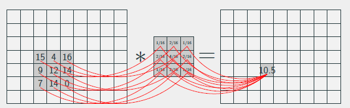
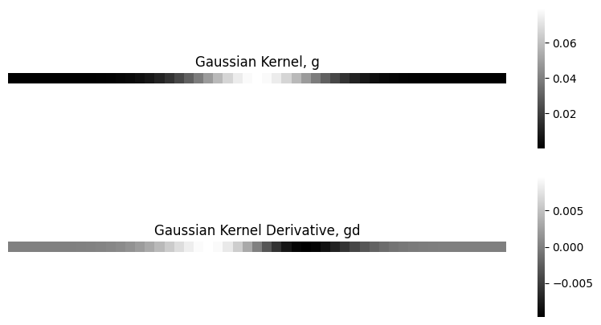
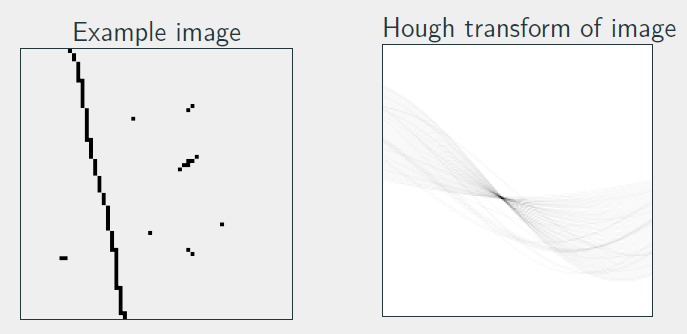
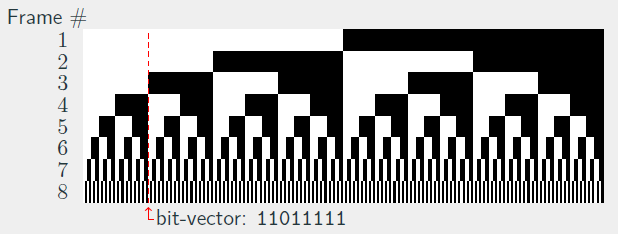
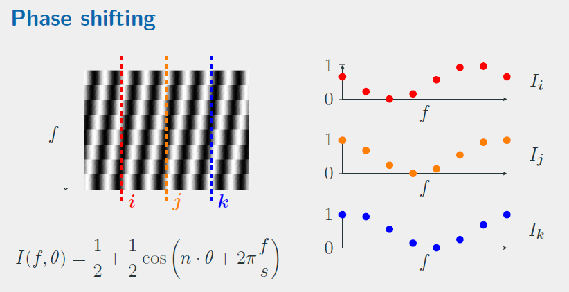
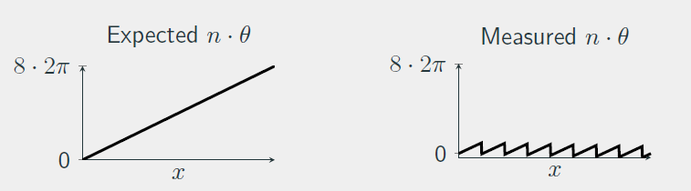
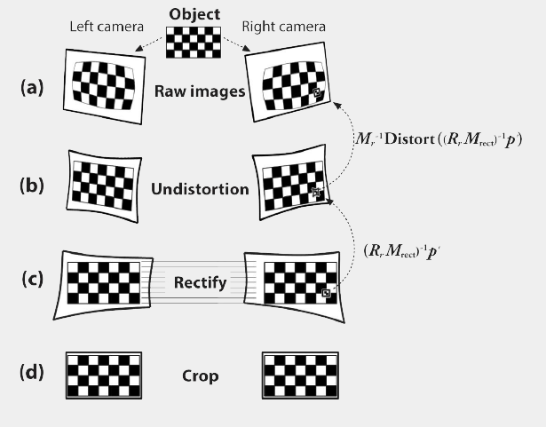

# ComputerVision02504

Syntax for writing markdown: [ashki23](https://ashki23.github.io/markdown-latex.html)

Export markdown file to HTML: [Markdown+Math](https://marketplace.visualstudio.com/items?itemName=goessner.mdmath) VSCode extension

## Topics Covered

|Week               | Topic     |
|:------------------|:----------|
| [Week 1: Pinhole and homogeneous](#week-1-pinhole-and-homogeneous) | Homogenous coordinates   pinhole model   projection |
| [Week 2: Camera model and homography](#week-2-camera-model-and-homography) | Camera model   Lens distortion   Homography   Point normalization |
| [Week 3: Multiview geometry](#week-3-multiview-geometry) | Epipolar   Essential matrix   Fundamental matrix   Triangulation |
| [Week 4: Camera calibration](#week-4-camera-calibration) | Direct linear transformation   Linear camera calibration|
| [Week 5: Nonlinear and calibration](#week-5-nonlinear-and-calibration) | Levenberg-Marquardt   Gradients   Rotations in optimization |
| [Week 6: Simple Features](#week-6-simple-features) | Harris corner   Gaussian filtering   Gaussian derivative |
| [Week 7: Robust model fitting](#week-7-robust-model-fitting) | Hough line   Hough transform   RANSAC |
| [Week 8: SIFT features](#week-8-blobs-and-sift-features) | BLOB detection   Scale space pyramid   Difference of Gaussians   SIFT features |
| [Week 9: Geometry Constrained Feature  Matching](#week-9-geometry-constrained-feature-matching) | Esimate Fundamental matrix using RANSAC   Sampson's distance |
| [Week 10: Image Stitching](#week-10-image-stitching) | Estimate Homography   Panoramas |
| [Week 11: Visual Odometry](#week-11-visual-odometry) | Estimate Essential matrix   Perspective-n-Point |
| [Week 13: Structured Light](#week-13-structured-light) | Binary encoding   Gray code encoding   Phase shift encoding |

### Miscellaneous Notes

Scale-invariant: functionally equivalent after scalar multiplication (deals with homogeneous coordinates)

- Homography matrix, $H$
- Essential matrix, $E$
- Fundamental matrix, $F$

Scale-variant

- Projection matrix, $P$
- Rotation matrix, $R$
- Camera instrinsics, $K$
- Translation vector, $t$

## Week 1: Pinhole and Homogeneous

[Back to top](#topics-covered)

### Pinhole camera

- In pixel coordinates, (0,0) is usually in the upper left corner of the image
- $\delta_x , \delta_y$ is used to translate (0,0) from principal point to the upper left corner.
- $p_x = \frac{f}{P_z} P_x + \delta_x$
- $p_y = \frac{f}{P_z} P_y + \delta_y$
- $p_h = K P = \begin{bmatrix} f & \beta f & \delta_x \\  0 & \alpha f & \delta_y \\ 0 & 0 & 1 \end{bmatrix} P$

- Camera extrinsics: rotation $R$ and translation $t$
- Projection matrix (3x4), $\mathcal{P}$: $p_h = \mathcal{P} P_h = K \begin{bmatrix} R & t \end{bmatrix} P_h $
  - $p_h$: homogeneous 2D point, 3x1
  - $P_h$: homogeneous 3D point, 4x1

### Homogeneous coordinates

- Euclidean/rigid transformation, $P_1 = RP_0 + t$
- $\begin{bmatrix} 1 \\ 2 \\ 3 \\ 1 \end{bmatrix}$ and $\begin{bmatrix} 2 \\ 4 \\ 6 \\ 2\end{bmatrix}$ are the same point in homogeneous coordinates
- Homogeneous tranformation, $T = \begin{bmatrix} \mathbf{R} & \mathbf{t} \\ \mathbf{0} & 1\end{bmatrix}$ (4x4)
- $\Pi( \ )$: converts from homo to inhomo coordinates
- $\Pi^{-1}( \ )$: converts from inhomo to homo coordinates

### Homogeneous Lines

$$
\begin{align*}
0 &= ax + by +c \\
&= \begin{bmatrix} a \\ b \\ c \end{bmatrix}^T \begin{bmatrix} sx \\ sy \\ s \end{bmatrix} \\
&= l^T p_h
\end{align*}
$$

- If $a^2 + b^2 = 1$ and $s=1$, then $d = l^T p_h$, where d is the signed distance from the point to the line.
- $l^T p_h = 0$ means the point lies on the line
- $l_1 \times l_2 = q_h$ cross-product gives the intersection point of 2 lines

## Week 2: Camera Model and Homography

[Back to top](#topics-covered)

### Camera Intrinsics

$$
K = \begin{bmatrix}
f & \beta f & \delta_x \\
 0 & \alpha f & \delta_y \\
 0 & 0 & 1
\end{bmatrix}
$$

- focal length $f$: pixel distance from pinhole to image plane, performs scaling to make the projected point into pixel coordinates
- principal point $\delta_x \ \delta_y$: translates to make (0,0) correct
- skew parameters $\alpha \ \beta$: to correct for non-square pixels and non-rectangular pixels respectively
- $\mathcal{P} = K \begin{bmatrix}R & t \end{bmatrix}$ has 12 degrees of freedom (DoF): 5 from K, 3 rotation, 3 translation, 1 scale (not useful)

### Lens distortion

$$
\begin{align*}
\begin{bmatrix} x_d \\ y_d \end{bmatrix} &= dist \begin{bmatrix} x \\ y \end{bmatrix} \\
&= \begin{bmatrix} x \\ y \end{bmatrix} \cdot (1 + \Delta r (\sqrt{x^2+y^2}))
\end{align*}
$$

where, $\Delta r(r) = k_3r^2 + k_5r^4 + k_7r^6 + ...$

- Projection without distortion: $p = K \Pi^{-1} ( \Pi (\begin{bmatrix}R & t \end{bmatrix} Q))$
- Projection with distortion: $p_d = K \Pi^{-1} ( dist( \Pi (\begin{bmatrix}R & t \end{bmatrix} Q)))$
- Undistortion
  - use $dist(\cdot), K, p$ to find $p_d$
  - use bilinear interpolation to compute RGB at point $p_d$
  - inverting $dist(\cdot)$ is not needed, but can be done iteratively

### Homography, $q_1 = H q_2$

- establish pixel correspondence between 2 cameras viewing the same plane
- scale invariant
- 8 DoF: requires 4 pairs of points to estimate $H$, each pair imposes constraints on x and y
- $q_1 = H_1 Q, q_2 = H_2 Q$
- $q_1 = H_1 H_2^{-1} q_2 = H q_2$

Homography Estimation

$$
\begin{align*}
q_{1i} &= H q_{2i} \\
0 &= q_{1i} \times H q_{2i} \\
0 &= B^{(i)} flatten(H^T) \\
\end{align*}
$$

- where $B^{(i)}$ is a 3x9 matrix built from the x-y coordinates of the pair of points.
- Solve for H using SVD $s.t. ||B||_2 = 1$

### Point Normalization

- mean 0, standard deviation 1
- $p_i = \sigma \tilde{p}_i + \mu$
- $\tilde{q}_i = T q_i$, where q is homogeneous
- $q_i = T^{-1} \tilde{q}_i = \begin{bmatrix}\sigma_x & 0 & \mu_x \\ 0 & \sigma_y & \mu_y \\ 0 & 0 & 1 \end{bmatrix} \tilde{q}_i$
- Invert $T^{-1}$ to get $T$
- Estimate homography $\tilde{H}$ using normalized points, and obtain the homography $H$ that operates on the original points
  - $q_{1i} = T^{-1}_1 \tilde{H} T_2 q_{2i} = H q_{2i}$

## Week 3: Multiview Geometry

[Back to top](#topics-covered)

### Projections

- 3D point projects to a 2D point on a camera frame
- 3D line projects to a 2D line, except if the line is parallel to the projection line
- 3D plane projects to a 2D plane, except if the plane is parallel to the projection line

### Epipolar line

- A point seen in camera 1 lies along a specific 3D line
- That 3D line projects into a 2D line in camera 2 $\rarr$ epipolar line from $q_1$ to $Q$
- A point seen in camera 1 must lie along the epipolar line of camera 2
- All epipolar lines intersect at the epipoles

- Epipolar line in camera 2: $l_2 = F p_1$
- Epipolar line in camera 1: $l_1^T = q_2^T F$

### Essential Matrix, $E = [t]_{\times} R$

- Used to relate the normal of the epipolar plane given by a 3D point
- $q_i$: 2D point from {cam_i} in pixels
- $p_1$: 3D point from {cam1}
- $p_2$: correspoding 3D point from {cam2}
- $q = Kp$
- $p = K^{-1}q$

Vectors in the figure are in {cam2}. $R, t$ maps {cam1} wrt {cam2}

- $n = [t]_{\times} R p_1 = E p_1$
- $0 = p_2^T n = p_2^T E p_1$

### Fundamental Matrix, $F = K_2^{-T} E K_1^{-1}$

$$
\begin{align*}
p_2^T E p_1 &= 0 \\
(K_2^{-1}q_2)^T E (K_1^{-1}q_1) &= 0 \\
q_2^T K_2^{-T} E K_1^{-1} q_1 &= 0
\end{align*}
$$

- Epipolar line in camera 2: $l_2 = F p_1$
- Epipolar line in camera 1: $l_1^T = q_2^T F$
- Essential (3D) and Fundamentral matrices (2D) form requirements for pixel correspondence

$$
\begin{align*}
p_2^T E p_1 &= 0 \\
q_2^T F q_1 &= 0
\end{align*}
$$

### Triangulation

- Solving for the 3D point based on observation of the same point in many known cameras

$$
\begin{align*}
q_i =  \begin{bmatrix} s_i x_i \\ s_i y_i \\ s_i \end{bmatrix} = \mathcal{P}_iQ &= \begin{bmatrix} p_i^{(1)}Q \\ p_i^{(2)}Q \\ p_i^{(3)}Q \end{bmatrix} \\
(p_i^{(3)} Q) \begin{bmatrix} x_i \\ y_i \end{bmatrix} &= \begin{bmatrix} p_i^{(1)}Q \\ p_i^{(2)}Q  \end{bmatrix} \\
0 &= \begin{bmatrix} p_i^{(3)}x_i - p_i^{(1)} \\ p_i^{(3)}y_i - p_i^{(2)}  \end{bmatrix} Q \\
&= B^{(i)} Q
\end{align*}
$$

- use SVD to find $\argmin\limits_{Q} ||BQ||_2, s.t. ||Q||_2 = 1$
- In this linear algorithm, the error is larger for cameras that are further from Q due to the $s_i$ term.

## Week 4: Camera Calibration

[Back to top](#topics-covered)

### Direct Linear Transformation

$$
\begin{align*}
q_i &= \mathcal{P} Q_i \\
0 &= q_i \times \mathcal{P} Q_i \\
 &= B^{(i)} flatten(\mathcal{P}^T)
\end{align*}
$$

- where $B^{(1)}$ is a 3x12 matrix
- solve for B using SVD

### Zhang's method for linear calibration

- assume checkboard corners are at $z=0$, simplifies the projection equation

$$
\begin{align*}
q_ij &= H_i \tilde{Q}_j \\
H_i = [h_i^{(1)} h_i^{(2)} h_i^{(3)}] &= \lambda K [r_i^{(1)} r_i^{(2)} t_i] \\
{h_i^{(1)}}^T K^{-T} K^{-1}h_i^{2} &= 0 \\
{h_i^{(1)}}^T K^{-T} K^{-1}h_i^{1} = {h_i^{(2)}}^T K^{-T} K^{-1}h_i^{2} &= \lambda_i^2
\end{align*}
$$

- A single homography only fixes 2 DoF of a camera matrix.
- Rewriting the constraints into a matrix form,

$$
V b = \begin{bmatrix} v_i^{12} \\ v_i^{11} - v_i^{22}\\ ... \end{bmatrix} b = 0 \\
$$

where
$$
\begin{align*}
v_i^{\alpha \beta} b &= {h_i^{\alpha}}^T B h_i^{\beta} \\
b &= \begin{bmatrix}B_{11} & B_{12} & B_{22} & B_{13} & B_{23} & B_{33} \end{bmatrix} \\
B &= K^{-T} K^{-1}
\end{align*}
$$

- $v_i^{\alpha \beta}$ can be evaluated to a 1x6 vector.
- Solve $ Vb = 0$ for $b$ using SVD. Then, use formulas from Zhang's paper to find $K$.
- To find $R_i, t_i$,

$$
\begin{align*}
\lambda_i &= || K^{-1} h_i^{(1)}||_2 \\
r_i^{(1)} &= \frac{1}{\lambda_i}K^{-1}h_i^{(1)} \\
r_i^{(2)} &= \frac{1}{\lambda_i}K^{-1}h_i^{(2)} \\
r_i^{(3)} &= r_i^{(1)} \times r_i^{(2)} \\
t_i &= \frac{1}{\lambda_i}K^{-1}h_i^{(3)}
\end{align*}
$$

- Refer to slides handwritten notes or slides for more derivation equations.

### Reprojection Error

- Compute root mean squared error RMSE
- $RMSE = \sqrt{\frac{1}{n}\sum_i\sum_j ||\Pi(\tilde{q}_{ij}) - \Pi(q_{ij})||_2^2}$
- where $\tilde{q}_{ij}$ is reprojected using the found $K, R_i, t_i$

Practical considertaions

- Theoretically, at least 3 images are needed for calibration.
- Rotate the checkboards across the images
- Place the checkerboard at all positions around the  camera frame
- Have the checkerboard take up more area of the camera frame

## Week 5: Nonlinear and Calibration

[Back to top](#topics-covered)

The exercises do not really cover Levenberg-Marquardt, gradients and rotations.

Least-squares problem

$$
\min\limits_{x} e(x) = \min\limits_{x} || g(x) - y ||_2^2 \\
e(x) = f(x)^T f(x)
$$

### Levenberg-Marquardt

- least squares problem with 2nd order approximation using only 1st order derivatives
- Jacobian, $J$: contains all 1st order derivatives of f at $x_k$
- $\tilde{e}$ is a 2nd order approx of $e$ using only 1st order derivatives
- Find optimum by setting derivative equal to zero

$$
2 J^T f(x_k) + 2 J^T J \delta = 0 \\
J^T J \delta = - J^T f (x_k)
$$

- solve for $\delta$, set $x_{k+1} = x_k + \delta$
- Use gradient descent to get closer to the minimum

### Gradients: analytical or finite differences (Taylor series)

1. Analytical gradients: + accurate, + fast computation, - complicated

2. Finite differences using Taylor series
    - 1st order, forward differences: $\frac{d}{dx} f(x) =  \frac{f(x+h)-f(x)}{h}+O(h)$
    - 2nd order, central differences: $\frac{d}{dx} f(x) =  \frac{f(x+h)-f(x-h)}{2h}+O(h^2)$, more accurate & computation
    - $h$ is chosen as a fixed percentage of x

### Rotations in Optimization

- Euler angles: 3 numbers, one for each axis, prone to gimbal lock
- Axis angles: rotation $\theta$ about axis $v$, store as 3 elements with $v*\theta$, singularity at $0$
- Quaternions: 4 numbers with $q_1^2 + q_2^2 + q_3^2 + q_4^2 = 1$, requires normalization at each step

Camera Calibration (advanced issues)

- ChArUco boards 
- Subpixel corner estimation
- Be mindful of over-fitting, cross-validation

## Week 6: Simple Features

[Back to top](#topics-covered)

Problems with image correspondence

- Scale, rotation, translation $\to$ appearance changes depending on distance and pose of camera
- Other issues: occlusion, lighting intensity, lighting diretion, clutter
- Key points/interest points/feature points: coordinate position of points in an image
- Descriptors: characterizes pattern around a point (usually a vector)

### Convolution

- Synonymous with filtering.
- Is commutative $I_g = g * I = I * g$
- Is separable $I_g = (g*g^T) * I = g * (g^T*I)$
- Size of Gaussian filter
  - Uses an empiric rule of $3\sigma$ or $5\sigma$
  - size = $ 2 \cdot rule \cdot \sigma + 1$
  - e.g. 5-rule, $\sigma=2$, size $= 2 \cdot 5 \cdot 2 + 1 = 21$

### Derivative of Gaussian

$$
g_d(x) = \frac{d}{dx}g(x) = \frac{-x}{\sigma^2}g(x)
$$

Derivative of blurred image $I_b$ in the x-direction is

$$
\begin{align*}
\frac{\partial}{\partial x}I_b &= \frac{\partial}{\partial x}(g * g^T * I) \\
&= g * (\frac{\partial}{\partial x}g^T) * I \\
&= g * g_d^T * I
\end{align*}
$$

### Harris Corners

- Points with locally maximum change from a small shift
- A local area where $\Delta I(x,y,\Delta_x, \Delta_y)^2$ is large no matter $\Delta_x, \Delta_y$

$$
\Delta I(x,y,\Delta_x, \Delta_y) = I(x,y,) - I(x+\Delta_x, y+ \Delta_y)
$$

Harris corner measure

- approximated using Taylor series expansion

$$
\begin{align*}
c(x,y,\Delta_xm \Delta_y) &= g * \Delta I(x,y,\Delta _x, \Delta _y) \\
&= g * (I(x,y,) - I(x+\Delta_x, y+ \Delta_y))^2 \\
&\approx g * (\begin{bmatrix}I_x & I_y\end{bmatrix} \begin{bmatrix} \Delta_x \\ \Delta_y \end{bmatrix})^2 \\
&= g * (\begin{bmatrix}I_x & I_y\end{bmatrix}
\begin{bmatrix}I_x^2 & I_x I_y \\ I_x I_y & I_y^2\end{bmatrix}
\begin{bmatrix} \Delta_x \\ \Delta_y \end{bmatrix}) \\
&=
\begin{bmatrix}I_x & I_y\end{bmatrix}
\begin{bmatrix}
g * (I_x^2) & g * (I_x I_y) \\[0.3em]
g * (I_x I_y) & g * (I_y^2) \\[0.3em]
\end{bmatrix}
\begin{bmatrix} \Delta_x \\ \Delta_y \end{bmatrix}
\end{align*}
$$

Structure tensor

$$
\begin{align*}
C(x,y) &=
\begin{bmatrix}
g * (I_x^2) & g * (I_x I_y) \\[0.3em]
g * (I_x I_y) & g * (I_y^2) \\[0.3em]
\end{bmatrix} \\
&= \begin{bmatrix}
a & c \\[0.3em]
c & b \\[0.3em]
\end{bmatrix} \\
\end{align*}
$$

Use eigenvalues $\lambda_1 , \lambda_2$ to find large values of $c(x,y,\Delta_x,\Delta_y)$

Harris corner metric

$$
\begin{align*}
r(x,y) &= \lambda_1 \lambda_2 - k(\lambda_1 + \lambda_2)^2  \\
&= ab - c^2 - k(a+b)^2
\end{align*}
$$

typically $k=0.06$

- Corners are at points with $r(x,y) > \tau$
- threshold $\tau$ is about $0.1\cdot max(r(x,y)) < \tau < 0.8 \cdot max (r(x,y))$
- Find local maximum using non-max suppression

### Canny Edges

- Metric is the gradient magnitude

$$
m(x,y) = \sqrt{I_x^2(x,y) + I_y^2(x,y)}
$$

- Choose $\tau_1 > \tau_2$
- seed: labels edges with a $m(x,y) > \tau_1$
- grow: grow edges with a $m(x,y) > \tau_2$, label iff new points are next to previously labelled edges

## Week 7: Robust Model Fitting

[Back to top](#topics-covered)

### Hough Lines

- Vertical lines are undefined in cartesian $\Rightarrow$ use polar coordinates
- Represent a line with $\theta, r$
  - $\theta$ is the angle between norm and x-axis
  - $r$ is the norm distance of the line from the origin

<!--  -->

Hough Transform

- Each point votes for all the possible lines that go through it
- Each point corresponds to a line in Hough space
- Peak in hough space $\Rightarrow$ line in image
- Find peaks using non-max suppression in a region
- Hough space not practical for more than 3 DoF

### Random sample consensus, RANSAC

- Randomly sample minimum number of points needed to fit the model
  - e.g. 2 data points for a line
  - e.g. 8 corresponding data points for fundamental matrix
- Fit the model to the random samples
- Measure inliers that are close to the model below a threshold $\rarr$ indicates good fit of model
  - e.g. euclidean distance for a line
  - e.g. sampson distance for fundamental matrix
- Consensus is the number of inliers
- Keep track of best model and best inliers with the highest consensus
- Refit model to all inliers of the best model

RANSAC iterations

- Estimate the upper bound of the number of iterations required to have at least one sample with only inliers
- The estimate is updated while running RANSAC
- $\hat \epsilon = 1 - \frac{s}{m}$
  - s: no. of inliers of best model
  - m: total no. of data points
- $\hat N = \frac{log(1-p)}{log((1-(1-\hat \epsilon)^n))}$
  - p: probability that at least one of N samples has only inliers, e.g. $0.99$
- Terminate once there are more than $\hat N$ iterations

| Model | Codimension | $T^2$ |
| :----: | :------: | :------:|
| Line | 1 | $3.84 \sigma^2$ |
| Fundamental Matrix | 1 | $3.84 \sigma^2$ |
| Essential Matrix | 1 | $3.84 \sigma^2$ |
| Homography | 2 | $5.99 \sigma^2$ |
| Camera Matrix | 2 | $5.99 \sigma^2$ |

## Week 8: BLOBs and SIFT features

[Back to top](#topics-covered)

See examples in [ex8.ipynb](notebooks/ex8.ipynb)

### SIFT

- features localized at interest points, adapted to scale, inavariance to appearance changes
- scale-space blob detection using difference of Gaussians (DoG)
- interest point localization
- orientation assignment
- interest point descriptor

BLOB: binary large object

Hessian matrix

$$
H =
\begin{bmatrix}
I_{xx}(x,y) & I_{xy}(x,y) \\[0.3em]
I_{xy}(x,y) & I_{yy}(x,y) \\[0.3em]
\end{bmatrix}
$$

- contains 2nd order derivatives of images
- measures curvature
- eigenvalues and eigenvectors are used to measure the direction of most change
- the Laplacian is used to estimate the eigenvalues (?)
- the Laplacian is approximated with DoG

Difference of Gaussians (DoG)

$$DoG = L(x,y,k\sigma) - L(x,y,\sigma)$$

- iteratively blurring already blurred images (efficient)
- scale invariance: allows features to be detected at different scales
- kernel size increase with each iteration
- the same threshold can be applied for all scale spaces
- find local extrama of DoGs in scale space
  - use absolute to find min & max simultaneously

Orientation assignment

- compute orientation of gradient around BLOB
- compute circular histogram of gradient orientations
- use histogram peak to assign orientation of point

Matching descriptors

- Use Euclidean distance between normalized vectors
- Cross checking: keep matches that are closest to each other
- Ratio test: compute ratio betwen closest and 2nd closest match, keep if it is below threshold e.g. 0.7

Variations

- RootSIFT: Hellinger kernel
- SURF, ORB, BRIEF, BRISK

## Week 9: Geometry Constrained Feature Matching

[Back to top](#topics-covered)

Fundamentral and Essential Matrix

$$
\begin{align*}
E &= [t]_xR \\
F &= K_2^{-T}EK_1^{-1} \\
0 &= q_2^TFq_1
\end{align*}
$$

Estimate F by solving $0 = B^{(i)} flatten(F) $ using SVD, where:

$$
\begin{align*}
B^{(i)} &= [x_{1i} x_{2i} \ \ \
y_{1i}x_{2i} \ \ \
x_{2i} \ \ \
x_{1i}y_{2i} \ \ \
y_{1i}y_{2i} \ \ \
y_{2i}  \ \ \
x_{1i} \ \ \
y_{1i} \ \ \
1] \\
flatten(F) &= [F_{11} \ \ F_{12} \ \ F_{13}
            \ \ F_{21} \ \ F_{22} \ \ F_{23}
            \ \ F_{31} \ \ F_{32} \ \ F_{33}]^T
\end{align*}
$$

F has 9 DoF, scale invariant  
$\Rightarrow$ 8 data points is sufficient  
$\Rightarrow$ 8 pairs of corresponding points

It is also possible to estimate using 7 points.

$ q_2i^TFq_1i $ is the distance from the epipolar lines.

Use **Sampson's distance** to measure distance from model.

$$
d_{Samp} (F, q_{1i}, q_{2i}) =
\dfrac{(q_{2i}^T F q_{1i})^2}
{(q_{2i}^T F)_1^2 +
(q_{2i}^T F)_2^2 +
(F q_{1i})_1^2 +
(F q_{1i})_2^2}
$$

Threshold for RANSAC

- Assume each sample has error with m-dimensional normal distribution
- Choose a confidence level e.g. 95%
- Look up CDF for $\chi_m^2$ distribution

RANSAC Workflow

1. Find features in both images using SIFT
2. Match features using brute force matcher (e.g. 1000 matches)
3. Sample 8 of these matching features (8 points from image 1, 8 points from image 2)
4. Estimate fundamental matrix using SVD
5. Compute sampson distance to estimated F for all matches
6. Classify matches as inliers if distance < threshold
7. Repeat for fixed number of iterations
8. Refit fundamental matrix on set of best inliers

## Week 10: Image Stitching

[Back to top](#topics-covered)

Panoramas

- When the camera rotates without translation, there are no perspective deformations
- Assume the world is flat $\rarr$ equivalent to look at a flad 2D world image

Measuring the error of a match: determine if a pair of points are inliners with respect to a homography.

$$
\tilde{q_1} = q_1 + \epsilon_1, \tilde{q_2} = q_2 + \epsilon_2 \\
\tilde{p_1} = \Pi^{-1} (\tilde{q_1}), \tilde{p_2} = \Pi^{-1} (\tilde{q_2})
$$

A possible error could be $||\tilde{q_1} - \Pi(H \Pi^{-1}(q_2)) ||^2_2 + ||\tilde{q_2} - q_2||^2_2$, but this does not work because $q_2$ is unknown

Instead use the following approximation:

$$
dist^2_{approx} = ||\tilde{q_1} - \Pi(H \tilde{p_2}) ||^2_2 + ||\tilde{q_2} - \Pi(H^{-1}\tilde{p_1})||^2_2
$$

Transforming & warping images

- generate all x,y coordinates for all pixels in reference image
- map these to other image using homography
- use bilinear interpolation to compute values at the transformed pixel locations
- warp only valid parts of each image

Compositing images

- averge, overlap, median, graph cut

## Week 11: Visual Odometry

[Back to top](#topics-covered)

Visual odometry, structure from motion (SfM), simulataneous localization and mapping (SLAM)

- scale of $t$ is unknown

### Estimating E

- $E$ has 5 DoF: 3 rotations, 2 translations.
- solved using Nister's 5-point algorithm in OpenCV
- $E$ can be computed from $R$ and $t$, but there are 2 possible rotations and the sign of translation is unknown
- choose the pose with the most points in front of both cameras
- To find the pose of a 3rd camera,
  - use translation between the first 2 cameras to fix the scale
  - triangulate points using the first 2 cameras
  - use 3D points to find pose of the 3rd camera

### Perspective-n-Point

- estimating the pose of a calibrated camera from $n$ corresponding 3D-2D correspondences
- 3 correspondences are required (minimal case of P3P)
- 3 2D points give 3 pairwise angles, distances between 3 3D points give 3 pairwise distances
- 4th correspondence is used to choose the correct solution from 4 possible solutions
- orientation of camera: $R^T$
- position of camera: $-R^Tt$

Outline

1. Use $E$ or $F$ matrix to estimate pose of the 2nd camera
2. Triangulate points using the known camera poses
3. Use PnP to estimate pose of the next camera
4. Repeat steps 2 and 3

## Week 13: Structured Light

[Back to top](#topics-covered)

### Laser line scanning

- detect laser line in each image, triangulate, repeat
- slow method due to one triangulation line per image

Encoding surfaces

1. For each pixel in the camera, identify the code/color
2. For each code/code border, identify the corresponding light plane
3. Triangulate using pixel rays and the "laser plane"

### Binary encoding

- discrete encoding scheme: only 3D points at code-borders
- frame + inverted frame improves robustness against ambient light and varying object color
- N frames $/rarr$ $2^N$ unique regions, $2^N-1$ unique borders
- With 1920 pixels wide, $N \le \log_2(W) \approx 10.9$. Max of 20 frames in total with inverted frames.
- suffers from the border problems where a single bit change great changes the code

$$N \le \log_2(W)$$

### Gray code encoding

- discrete encoding scheme: only 3D points at code-borders
- overcomes border problems of binary encoding
- only 1 bit flip at code borders, with same number of frames as binary patterns

### Phase shift encoding

- continuous encoding scheme: 3D point for each pixel in the camera
- each point has a unique phase-plane ($\theta$)
- monochrome pattern is good for color objects
- the projector shoots a light intensity of $I(x,y) = \frac{1}{2} + \frac{1}{2} cos (n \cdot \theta (x))$

Workflow

- phase shift exactly one wavelength in $s$ steps
- use fast Fourier transform to fit a sinusoid and find $n \cdot \theta$ for a single picel
- the 2nd element of the FFT is a complex number with $\theta = angle(FFT_2)$

Phase wrapping

- the measured phase differs from the expected phase because the phases are wrapped to between 0 and $2 \pi$
- unwrapping is done using Heterodyne principle

Heterodyne principle

- a smart way to recover $\theta$ by subtracting the secondary phase from the primary phase
- project 2 patterns: primary pattern (period $n_1$) and secondary pattern (period $n_2$), such that $n_2 = n_1 + 1$
- phase cue, $\theta_c = mod(\theta_2 (x) - \theta_1 (x), 2 \pi)$ (linear in errors of $\theta_1$ and $\theta_2$)
- to make $\theta_{estimate}$ more robust to noise, using **order** and **rounding**
  - $o_1 = \lfloor \frac{n_1 \cdot \theta_c - \theta_1}{2 \pi} \rceil$ (round to nearest integer)
  - $\theta_{est} = \frac{2 \pi o_1 + \theta_1}{n_1} mod 2\pi$ (error of $\frac{\epsilon_1}{n_1}$)

Final notes

- instead of projector plane triangulation, epipolar lines in the cameras can be used
- provided that the project planes are not parallel with the epipolar planes
- rectifying: virtually make cameras parallel to each other, so that epipolar lines are corresponding rows

